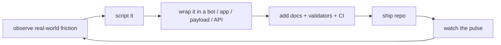

<div align="center">

# 🐍 ooovenenoso

### Builder of practical systems: automation · security research · bots · game/community tools · web apps · AI infrastructure


[](https://github.com/ooovenenoso)
[](https://github.com/ooovenenoso?tab=repositories)
[](https://github.com/ooovenenoso?tab=followers)
[](https://github.com/ooovenenoso?tab=repositories)
[](https://github.com/ooovenenoso?tab=repositories)
[](https://github.com/ooovenenoso)

</div>

---

## 📡 Live pulse

<div align="center">


</div>

### Current public snapshot

- **63 public repositories** across automation, security research, Discord bots, game tooling, SaaS/web systems, Google Apps Script utilities, IoT/API experiments, MCP, and AI infrastructure.
- **394+ public stars** and **38+ forks** across the visible arsenal.
- Most visible public languages: **Python, JavaScript, TypeScript, PowerShell, HTML, GDScript**.
- Recent movement includes upstream PRs to `llama.cpp`, `diffusers`, and `hermes-agent`, plus active maintenance of BadUSB/MCP tooling.

> No sabemos si es `ooovenenoso`... o sus **pirañas digitales** moviéndose debajo del agua.

---

## 🗺️ Repo landscape

This profile is not just AI. The repo map is closer to a **field kit for automation-heavy builders**:

### 🔐 Security research / payload engineering
- `BadUSB-GPT` — GPT-assisted Rubber Ducky / BadUSB research workflows.
- `CHOCO-DUCKY-Software-Installation-with-Chocolatey` — Windows software installation via DuckyScript + Chocolatey.
- `Flipper-Zero-BadUSB`, `Flipper`, `usbrubberducky-payloads` — Flipper Zero and USB payload experiments.
- `CounterCrowdStrike` — Windows recovery automation concept.
- `mitmproxy`, `rce.js`, `Warfare-X-RCE` — security/dev tooling and community platform experiments.

### 🤖 Bots / Discord / messaging automation
- `FaceSearchBot` — Discord face/image search automation.
- `Dall-E-3-Discord-Bot` — image generation bot.
- `DisQRd-QR-Code-and-Barcode-Generator-for-Discord` — QR/barcode bot.
- `Mailer-Automation-ADB`, `ShellMS`, `SMS-INSTINCT-OPENAI` — SMS / ADB / marketing automation.
- `ChatGPTFacebookPage` — Facebook page chatbot with context.

### 🎮 Game communities / Rust Console / Portal tools
- `Bunkerfy.top-qv` — marketplace / escrow concept for Arc Raiders items.
- `Warfare-X-RCE` — Rust Console community platform with credits, kits, analytics.
- `Rust-Console-Edition-Commands-and-Functions-JSON` — command/config library for server tooling.
- `CNQR-VENDING-MACHINE-FOR-RCE` — Rust Console economy/vending platform concept.
- `Battlefield-Portal-MCP`, `PortalSDK`, `Battlefield-6-Portal-MCF-GODOT` — Battlefield Portal + Godot/MCP experiments.

### 🧾 Business / civic / ops automation
- `Employee-Document-Report-Generator` — document status reports with Google Apps Script.
- `Resolvia` — ticketing, numbering, email notifications, daily reports.
- `Tiny-Timely` — reminder automation for medical/dental evaluation workflows.
- `TinoAire` — air quality reports with IQAir API + email scheduling.
- `Caguas_2024` — Caguas Energy Hackathon material.
- `athmovil-javascript-api` — ATH Móvil payment button technical docs.

### 🌐 Web apps / SaaS / dashboards
- `saasfly`, `saas-starter` — SaaS templates and Next.js starter systems.
- `panel` — game server panel ecosystem.
- `NitrAPI` — Nitrado REST API work.
- `google-ads-mcp-server` — Google Ads performance analysis tooling.
- `Supabase-Keepalive-Script` — operational keepalive for Supabase projects.

### 🧠 AI / LLM / MCP infrastructure
- `llama.cpp`, `diffusers`, `hermes-agent` — upstream AI infrastructure contributions.
- `windows-mcp-ducky-installer`, `servers`, `awesome-mcp-servers`, `best-of-mcp-servers`, `schemaflow-mcp-server`, `godot-mcp` — MCP ecosystem work.
- `SmartSnip`, `SnippingToolGPT`, `pothole-computer-vision-project`, `openai-mqtt-nodejs` — applied AI / vision / IoT experiments.
- `Top-AI-Tools`, `system_prompts_leaks`, `Jupyter-Notebook-ChatGPT-Prompt-Engineering-for-Developers` — AI research and reference collections.

---

## 🧰 Tech arsenal

<div align="center">

### Languages / runtime


### Web / data / backend


### Automation / ops / platforms


### Security / hardware-adjacent research


### AI / agents / MCP


</div>

---

## 🔥 Featured arsenal pulses

| Project | Live pulse | Field |
|---|---:|---|
| [`BadUSB-GPT`](https://github.com/ooovenenoso/BadUSB-GPT) |    | BadUSB / DuckyScript / AI-assisted payload research |
| [`CHOCO-DUCKY-Software-Installation-with-Chocolatey`](https://github.com/ooovenenoso/CHOCO-DUCKY-Software-Installation-with-Chocolatey) |   | Windows software automation |
| [`FaceSearchBot`](https://github.com/ooovenenoso/FaceSearchBot) |   | Discord / image search automation |
| [`Dall-E-3-Discord-Bot`](https://github.com/ooovenenoso/Dall-E-3-Discord-Bot) |   | Discord / image generation |
| [`Bunkerfy.top-qv`](https://github.com/ooovenenoso/Bunkerfy.top-qv) |   | Marketplace / escrow / web app |
| [`Rust-Console-Edition-Commands-and-Functions-JSON`](https://github.com/ooovenenoso/Rust-Console-Edition-Commands-and-Functions-JSON) |   | Game server configuration / AI training data |
| [`TinoAire`](https://github.com/ooovenenoso/TinoAire) |   | Civic data / air quality reporting |
| [`llama.cpp`](https://github.com/ooovenenoso/llama.cpp) |  | LLM infrastructure contribution |

---

## 🐟 Digital piranhas operating map



```text
base:     Puerto Rico
mode:     automate the boring, sharpen the useful, document the dangerous
fields:   security research · bots · games · web apps · civic ops · AI/MCP
signal:   practical tools over theory
```

---

## 🧬 Contribution DNA

<div align="center">


</div>

---

## 🐍 Signature

> If a repo wakes up with validators, CI, docs, payload hygiene, bots, dashboards, scripts, and one suspiciously clean commit trail...
>
> Maybe it was `ooovenenoso`.
>
> Maybe it was the **digital piranhas**.
>
> Either way, something got built.

<div align="center">

**Automation-first · security-aware · game/community builder · web systems · AI when useful**

</div>
