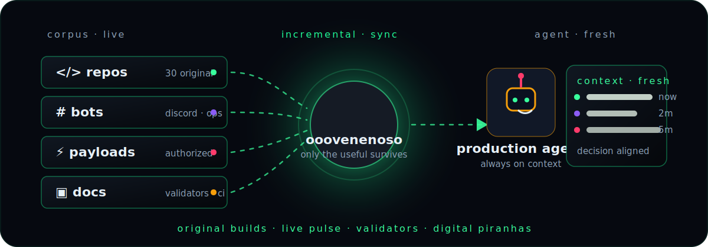
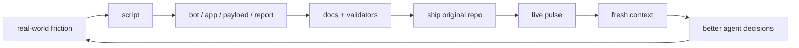

<div align="center">



# 🐍 ooovenenoso

## Your projects deserve **fresh signal**.

**Original builds · automation · security research · Discord bots · game/community tooling · civic ops · applied AI**


[](https://github.com/ooovenenoso)
[](https://github.com/ooovenenoso?tab=repositories)
[](https://github.com/ooovenenoso?tab=repositories)
[](https://github.com/ooovenenoso?tab=followers)
[](https://github.com/ooovenenoso)

**Star the useful stuff** ⭐ → [Repos](https://github.com/ooovenenoso?tab=repositories) · [BadUSB-GPT](https://github.com/ooovenenoso/BadUSB-GPT) · [SnippingToolGPT](https://github.com/ooovenenoso/SnippingToolGPT)

</div>

---

## 📡 Fresh context layer

`ooovenenoso` turns code, docs, bots, payloads, game/server tools, and ops scripts into a public build map with live signals — stars, forks, commits, languages, validators, and project lanes.

**Incremental** · only the useful delta  
**Any scale** · tiny scripts to full community platforms  
**Declarative** · README, badges, CI, docs, validators  
**Agent-ready** · clear context for humans, agents, and future automation

> No sabemos si es `ooovenenoso`... o sus **pirañas digitales** moviéndose debajo del agua.

---

## 🔴 Live pulse

<div align="center">


</div>

### Verified snapshot

- **65 public repos** visible under `ooovenenoso`.
- **30 original public repos**; **35 forks/upstream work** kept separate.
- **377 stars** and **36 forks** across original public repos at last scan.
- Main original languages: **Python, JavaScript, TypeScript, HTML**, plus DuckyScript / PowerShell-style payload work.
- Core pattern: practical tools, bots, automation scripts, security-aware payloads, game/community utilities, civic/business reporting, and applied AI.

---

## 🧭 Repo signal map

### 🔐 Security research / payload engineering

- [`BadUSB-GPT`](https://github.com/ooovenenoso/BadUSB-GPT) — GPT-assisted Rubber Ducky / BadUSB research workflows.  
- [`windows-mcp-ducky-installer`](https://github.com/ooovenenoso/windows-mcp-ducky-installer) — authorized Windows-MCP installer payload with Discord status reporting.
- [`CHOCO-DUCKY-Software-Installation-with-Chocolatey`](https://github.com/ooovenenoso/CHOCO-DUCKY-Software-Installation-with-Chocolatey) — Windows software installation with DuckyScript + Chocolatey. 
- [`CounterCrowdStrike`](https://github.com/ooovenenoso/CounterCrowdStrike) — Windows recovery automation concept.
- [`QuackControl`](https://github.com/ooovenenoso/QuackControl) — voice-to-DuckyScript automation.

### 🤖 Bots / Discord / messaging automation

- [`FaceSearchBot`](https://github.com/ooovenenoso/FaceSearchBot) — Discord face/image search automation. 
- [`Dall-E-3-Discord-Bot`](https://github.com/ooovenenoso/Dall-E-3-Discord-Bot) — Discord bot for AI-powered image generation. 
- [`DisQRd-QR-Code-and-Barcode-Generator-for-Discord`](https://github.com/ooovenenoso/DisQRd-QR-Code-and-Barcode-Generator-for-Discord) — QR/barcode generation bot.
- [`Mailer-Automation-ADB`](https://github.com/ooovenenoso/Mailer-Automation-ADB) — Discord + spreadsheet + ADB/ShellMS SMS automation.
- [`SMS-INSTINCT-OPENAI`](https://github.com/ooovenenoso/SMS-INSTINCT-OPENAI) — Spanish marketing text enhancement bot.

### 🎮 Game communities / server tools

- [`Bunkerfy.top-qv`](https://github.com/ooovenenoso/Bunkerfy.top-qv) — marketplace / escrow concept for Arc Raiders items. 
- [`Warfare-X-RCE`](https://github.com/ooovenenoso/Warfare-X-RCE) — Rust Console community platform with credits, kits, analytics.
- [`Rust-Console-Edition-Commands-and-Functions-JSON`](https://github.com/ooovenenoso/Rust-Console-Edition-Commands-and-Functions-JSON) — command/config library for Rust Console server workflows.
- [`Rust-Console-Edition-Command-Library-Extension`](https://github.com/ooovenenoso/Rust-Console-Edition-Command-Library-Extension) — helper extension for Rust Console commands.
- [`CNQR-VENDING-MACHINE-FOR-RCE`](https://github.com/ooovenenoso/CNQR-VENDING-MACHINE-FOR-RCE) — Rust Console economy/vending platform concept.
- [`Battlefield-Portal-MCP`](https://github.com/ooovenenoso/Battlefield-Portal-MCP) — Battlefield Portal SDK + Godot/MCP workflow experiment.

### 🧾 Business / civic / ops automation

- [`Employee-Document-Report-Generator`](https://github.com/ooovenenoso/Employee-Document-Report-Generator) — Google Apps Script document status reports.
- [`Resolvia`](https://github.com/ooovenenoso/Resolvia) — ticketing, numbering, email notifications, daily reports.
- [`Tiny-Timely`](https://github.com/ooovenenoso/Tiny-Timely) — reminder automation for medical/dental evaluation workflows.
- [`TinoAire`](https://github.com/ooovenenoso/TinoAire) — IQAir API reporting with email scheduling. 
- [`Supabase-Keepalive-Script`](https://github.com/ooovenenoso/Supabase-Keepalive-Script) — operational keepalive for Supabase projects.
- [`MindFlare-GPT-Personality-Test`](https://github.com/ooovenenoso/MindFlare-GPT-Personality-Test) — interactive personality profile generator.

### 🌐 Web / product / applied AI tools

- [`SnippingToolGPT`](https://github.com/ooovenenoso/SnippingToolGPT) — Chrome extension for real-time screenshot analysis. 
- [`VenomLog-Resources`](https://github.com/ooovenenoso/VenomLog-Resources) — support resources for VenomLog workflows.
- [`Battlefield-6-Portal-MCF-GODOT`](https://github.com/ooovenenoso/Battlefield-6-Portal-MCF-GODOT) — Battlefield Portal / Godot-side experiment.
- [`Boosty-Resources`](https://github.com/ooovenenoso/Boosty-Resources) — resource collection.
- [`Jupyter-Notebook-ChatGPT-Prompt-Engineering-for-Developers`](https://github.com/ooovenenoso/Jupyter-Notebook-ChatGPT-Prompt-Engineering-for-Developers) — notebook/course material around prompt engineering.

---

## 🧰 Tech arsenal

<div align="center">

### Languages / runtime


### Web / data / backend


### Automation / ops / platforms


### Security / hardware-adjacent research


### AI when useful


</div>

---

## 🧪 Context quality checks

<div align="center">


</div>

- Original repos are presented as original builds.
- Forks and upstream work are **not** counted as owned project inventory.
- Security/payload projects are framed for authorized research and defensive/administrative workflows.
- Badges and cards keep the profile fresh without stale manual counters where dynamic sources exist.

---

## 🌉 Forks / upstream work note

Some public repos under this account are **forks** used for study, experiments, or upstream contribution work. They are separate from the original-build map above.

Recent upstream contribution targets include:

- `ggml-org/llama.cpp`
- `huggingface/diffusers`
- `NousResearch/hermes-agent`

---

## 🐟 Digital piranhas operating map



```text
base:     Puerto Rico
mode:     automate the boring, sharpen the useful, document the dangerous
fields:   security research · bots · games · web apps · civic ops · AI when useful
signal:   practical tools over theory
style:    low-noise, high-signal, agent-ready context
```

---

## 🧬 Contribution DNA

<div align="center">


</div>

---

## 🐍 Signature

> If a repo wakes up with validators, docs, payload hygiene, bots, dashboards, scripts, and one suspiciously clean commit trail...
>
> Maybe it was `ooovenenoso`.
>
> Maybe it was the **digital piranhas**.
>
> Either way, something got built.

<div align="center">

**Original automation · security-aware builds · game/community tooling · civic ops · fresh context for useful agents**

Deutsch · English · Español · Français · 日本語 · 한국어 · Português · Русский · 中文

</div>
