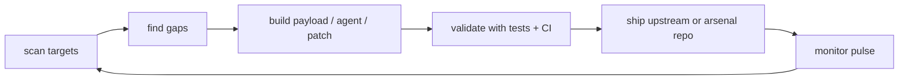

<div align="center">

# 🐍 ooovenenoso

### AI systems · automation arsenal · security research · MCP tooling · LLM/LMM infrastructure


[](https://github.com/ooovenenoso)
[](https://github.com/ooovenenoso?tab=repositories)
[](https://github.com/ooovenenoso?tab=followers)
[](https://github.com/ooovenenoso?tab=repositories)
[](https://github.com/ooovenenoso)

</div>

---

## 📡 Live pulse

<div align="center">


</div>

### Recent public movement

- Opened upstream PRs into foundational AI repos:
  - [`ggml-org/llama.cpp`](https://github.com/ggml-org/llama.cpp) — LLM inference / GGUF ecosystem
  - [`huggingface/diffusers`](https://github.com/huggingface/diffusers) — diffusion, video, and multimodal pipelines
  - [`NousResearch/hermes-agent`](https://github.com/NousResearch/hermes-agent) — autonomous agent infrastructure
- Active repo pulse includes: `BadUSB-GPT`, `windows-mcp-ducky-installer`, `hermes-agent`, `llama.cpp`, `diffusers`.
- Public arsenal snapshot: **62 repos · 394 stars · 38 forks · 53 followers**.

> No sabemos si es `ooovenenoso`... o sus **pirañas digitales** moviéndose debajo del agua.

---

## 🧰 Tech arsenal

<div align="center">

### Languages / runtime


### AI / LLM / automation stack


### Security / payload / ops


</div>

---

## 🐟 Digital piranhas operating map



```text
mode:     scan → validate → automate → harden → document → repeat
base:     Puerto Rico
style:    low-noise, high-leverage, tool-heavy
signal:   AI + automation + security research + practical shipping
```

---

## 🚀 Featured arsenal

| Project | Pulse | Role |
|---|---:|---|
| [`BadUSB-GPT`](https://github.com/ooovenenoso/BadUSB-GPT) |   | GPT-assisted DuckyScript research arsenal |
| [`windows-mcp-ducky-installer`](https://github.com/ooovenenoso/windows-mcp-ducky-installer) |  | Authorized Windows-MCP installer payload |
| [`CHOCO-DUCKY-Software-Installation-with-Chocolatey`](https://github.com/ooovenenoso/CHOCO-DUCKY-Software-Installation-with-Chocolatey) |  | Windows software automation with DuckyScript |
| [`FaceSearchBot`](https://github.com/ooovenenoso/FaceSearchBot) |  | Discord face/image search automation |
| [`QuackControl`](https://github.com/ooovenenoso/QuackControl) |  | Voice-to-DuckyScript automation |
| [`Top-AI-Tools`](https://github.com/ooovenenoso/Top-AI-Tools) |  | Curated AI tools index |

---

## 🧬 Contribution DNA

<div align="center">


</div>

---

## 🐍 Signature

> If a repo wakes up with validators, CI, docs, payload hygiene, and one suspiciously clean commit trail...
>
> Maybe it was `ooovenenoso`.
>
> Maybe it was the **digital piranhas**.
>
> Either way, something got built.

<div align="center">

**AI-armed · automation-first · security-aware · built from Puerto Rico**

</div>
