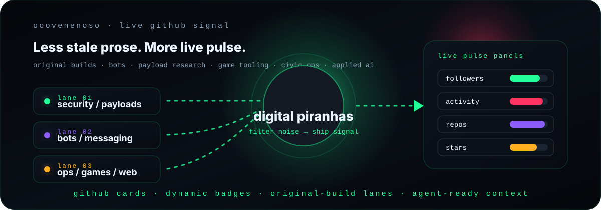
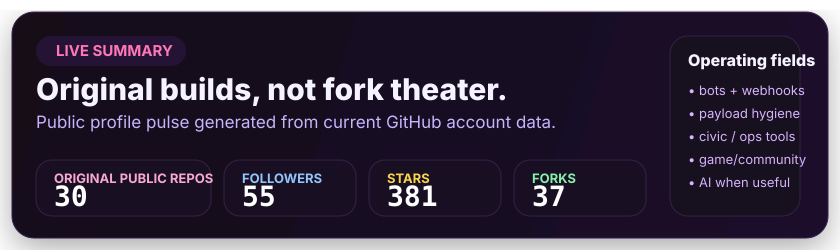
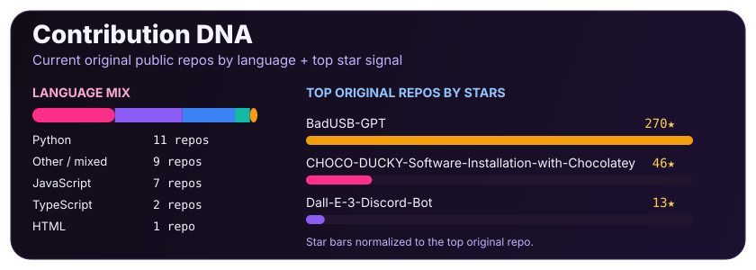

# 🐍 ooovenenoso

---

## 📌 Original builds

---

## 🧭 Signal lanes

### 🔐 Security / payload research

### 🤖 Bots / messaging / AI helpers

### 🎮 Game / web / ops

---

## 🧰 Arsenal

 

 

---

## 🧬 Contribution DNA

 

 

---

## 🐟 Signature

`fresh context` · `original builds` · `digital piranhas` · `agent-ready signal`

*Maybe it was ooovenenoso. Maybe it was the digital piranhas.*

